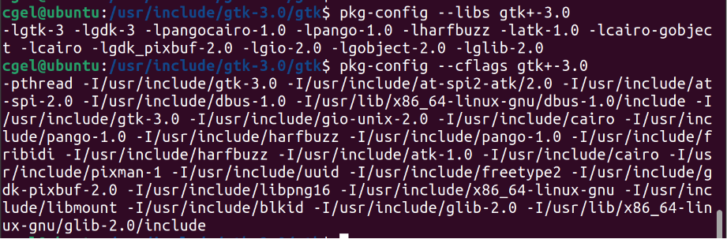

### 1 Gtk 的编译
gcc \`pkg-config --cflags gtk+-3.0\` -o a.out Gtk1.c \`pkg-config --libs gtk+-3.0\`
pkg-config 是解决依赖的一大利器 

\`pkg-config --cflags gtk+-3.0\` 解决有关头文件路径，
\`pkg-config --libs gtk+-3.0\` 解决有关库